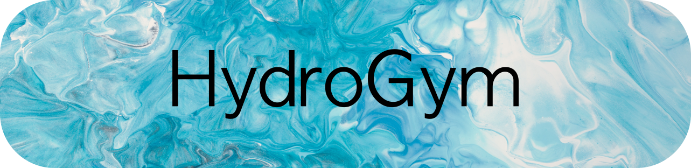

<p align="center">
<a rel="nofollow"></a>
</p>

<p align="center">
<a href="https://github.com/astral-sh/ruff"></a>
<a href="https://python.org/"></a>
<a href="https://spdx.org/licenses/MIT.html"></a>
<a href="https://join.slack.com/t/hydrogym/shared_invite/zt-27u914dfn-UFq3CkaxiLs8dwZ_fDkBuA"></a>
</p>

# HydroGym: Reinforcement Learning for Fluid Dynamics

**61+ environments | 6 solver backends | 2D & 3D | Ready for RL training**

HydroGym is a comprehensive platform for applying reinforcement learning to fluid dynamics and flow control. With environments ranging from canonical benchmarks to turbulent flows, HydroGym provides a standardized Gymnasium-compatible interface for training RL agents on challenging CFD problems.

## Key Features

- **Diverse Environments**: 61+ pre-configured environments across 6 CFD solvers
- **Standard RL Interface**: Gymnasium-compatible API works with Stable-Baselines3, RLlib, and other RL libraries
- **Compute Efficient**: Highly optimized GPU & CPU backends for efficient RL deployment ranging from local workstations to exascale HPC systems
- **Scalable**: MPI-parallelized solvers with distributed RL training support
- **Multiple Backends**: Finite Element (Firedrake), Lattice Boltzmann (MAIA LBM), Finite Volume (MAIA FV), Spectral Element (NEK5000), Fully Differentiable solvers (JAX-Fluids)
- **2D & 3D**: From simple 2D benchmarks to complex 3D turbulent flows (Re up to 400,000)
- **Research-Ready**: Managed by a complementary HuggingFace repository

## Quick Start with Docker (Recommended)

**We strongly recommend using our pre-configured Docker containers** for hassle-free setup:

```bash
# For NVIDIA GPUs (CUDA)
docker pull clagemann/hydrogym-nvhpc-26.1_cuda-12.9_hopper_blackwell:latest
# or
docker pull clagemann/hydrogym-nvhpc-26.1_cuda-12.9_turing_ampere:latest

# For AMD GPUs (ROCm)
docker pull clagemann/hydrogym-rocm-6.3.3:latest

# Run container
docker run -it --gpus all clagemann/hydrogym-nvhpc-26.1_cuda-12.9_turing_ampere:latest
```
## Available Environments

HydroGym provides **61 environments** across 6 solver backends:

| Solver Backend | Count | Description | Dimensions |
|----------------|-------|-------------|------------|
| **Firedrake** (FEM) | 20 | Canonical flow control benchmarks | 2D |
| **MAIA LBM** | 55 | Lattice Boltzmann method environments | 2D, 3D |
| **MAIA Structured FV** | 8 | High-Reynolds turbulent boundary layers | 3D |
| **NEK5000** | 2 | Spectral element turbulent channel flow | 3D |
| **JAX** | 2 | Differentiable fluid dynamics | 2D, 3D |
| **JAX-Fluids** | 2 | Compressible shock vector control | 2D, 3D |

### Environment Categories

**Canonical Benchmarks** (Low-Mid Re):
- Cylinder wake (Re=100-3900, 2D/3D)
- Rotating cylinder (Re=100-3900, 2D/3D)
- Pinball (Re=30-150, 2D/3D)
- Cavity flow (Re=4140-7500, 2D/3D)
- Backward-facing step (Re=600, 2D)
- Square cylinder (Re=200-3900, 2D/3D)
- Sphere (Re=300-3700, 3D)
- Cube (Re=300-3700, 3D)
- Turbulent channel flow (Re_tau=206, 3D)

**Airfoil Control**:
- NACA0012 steady (Re=100-50000, AOA=12-40°, 2D/3D)
- NACA0012 with gust disturbance (Re=100-50000, 2D/3D)

**High Reynolds Number Flows**:
- Zero-pressure-gradient turbulent boundary layer with jet/surface wave actuation (Re_Tau=180-2200, 3D)
- DRA2303 airfoil with jet/surface wave actuation (Re=400000, Ma=0.2-0.7, 3D)
- NACA0012 airfoil with jet actuation (Re=200000, 3D)

**Fully Differentiable Flows**:
- Shock-Vector Control in single divergent nozzle (SVC, Ma>1.0, 2D/3D)
- Turbulent channel flow (Re_tau=180, 3D)
- Kolmogorov flow (up to Re=1000, 2D)

## Environment Checkpoints

All required environment checkpoints are available via [HuggingFace](https://huggingface.co/datasets/dynamicslab/HydroGym-environments/tree/main) and are downloaded on the fly when an environment is first created (internet connection required). If no internet connection is available at runtime — e.g. on compute nodes in HPC clusters — you can pre-download the environment files as outlined in [examples/maia/README.md](examples/maia/README.md).

## Examples

HydroGym includes comprehensive examples for each solver backend (internet connection required). We highly recommend using our provided docker containers:

### Firedrake Examples

See [examples/firedrake/getting_started/](examples/firedrake/getting_started/) for detailed documentation.

```bash
cd examples/firedrake/getting_started

# Test environment interactively
./run_example_docker.sh

# Train with Stable-Baselines3
./run_example_docker.sh train
```

### MAIA Examples

See [examples/maia/getting_started/](examples/maia/getting_started/) for MPMD coupling details.

```bash
cd examples/maia/getting_started

# Prepare workspace (downloads from Hugging Face Hub) and 
# Run with MPMD execution (1 Python + 1 MAIA process on GPU)
./run_example_docker.sh

# Prepare workspace and train with Stable-Baselines3
./run_example_docker.sh train
```

### NEK5000 Examples

See [examples/nek/getting_started/](examples/nek/getting_started/) for interface patterns.

```bash
cd examples/nek/getting_started

# Test single-agent environment
cd 1_nekenv_single
./run_nekenv_docker.sh

# ... or train with pettinzoo wrapper and SB3
cd 3_pettingzoo
./run_pettingzoo_docker.sh train

# ... or run zero-shot transfer learning
cd 6_zeroshot_wing_demo
./run_pettingzoo_docker.sh
```

### JAX Examples

See [examples/jax/getting_started/](examples/jax/getting_started/) for detailed documentation.

```bash
cd examples/jax/getting_started

# Test Kolmogorov flow environment
cd 1_kolmogorov
./run_nekenv_docker.sh

# ... or test channel flow environment
cd 2_channel
./run_channel_docker.sh strong_actuation

# ... or run zero-shot transfer learning
cd 3_ppo
./run_ppo_docker.sh --env channel --num-envs 1 --num-steps 10 --num-minibatches 5
```

## Training RL Agents

HydroGym works with standard RL libraries. Example with Stable-Baselines3:

```python
from hydrogym import FlowEnv
import hydrogym.firedrake as hgym
from stable_baselines3 import PPO
from stable_baselines3.common.vec_env import DummyVecEnv, VecNormalize

# Create environment
def make_env():
    env_config = {
        'flow': hgym.Cylinder,
        'flow_config': {'mesh': 'medium', 'Re': 100},
        'solver': hgym.SemiImplicitBDF,
        'solver_config': {'dt': 1e-2},
        'actuation_config': {'num_substeps': 2},
    }
    return FlowEnv(env_config)

# Vectorize and normalize
env = DummyVecEnv([make_env])
env = VecNormalize(env, norm_obs=True, norm_reward=True)

# Train
model = PPO("MlpPolicy", env, verbose=1)
model.learn(total_timesteps=100000)
```

See also provided [examples/](examples/) for more details how to leverage individual solver backends for training.

## Advanced Features

- **Checkpoint management**: Automatic loading from Hugging Face Hub
- **Custom observations**: Force sensors, velocity/pressure/vorticity probes, stress sensors
- **Callbacks**: Checkpointing, logging, Paraview export
- **Stability analysis**: Global stability analysis via SLEPc (Firedrake)
- **Modal decompositions**: DMD, POD via modred (Firedrake)
- **Multi-agent RL**: PettingZoo interface for distributed actuation (NEK5000)

## Documentation

- **Getting Started Guides**: See `examples/[backend]/getting_started/README.md`
- **API Documentation**: [https://hydrogym.readthedocs.io](https://hydrogym.readthedocs.io)
- **Flow Configurations**: [docs/FlowConfigurations.md](docs/FlowConfigurations.md)
- **Paper**: [arXiv:2512.17534](https://arxiv.org/abs/2512.17534)

## Citation

If you use HydroGym in your research, please cite the following two papers:

```bibtex
@inproceedings{lagemann2025hydrogym_a,
  title={HydroGym: A Reinforcement Learning Platform for Fluid Dynamics},
  author={Lagemann, Christian and Paehler, Ludger and Callaham, Jared and Mokbel, Sajeda and Ahnert, Samuel and Lagemann, Kai and Lagemann, Esther and Adams, Nikolaus and Brunton, Steven},
  booktitle={7th Annual Learning for Dynamics$\backslash$\& Control Conference},
  pages={497--512},
  year={2025},
  organization={PMLR}
}
@article{lagemann2025hydrogym_b,
  title={Hydrogym: A reinforcement learning platform for fluid dynamics},
  author={Lagemann, Christian and Mokbel, Sajeda and Gondrum, Miro and R{\"u}ttgers, Mario and Callaham, Jared and Paehler, Ludger and Ahnert, Samuel and Zolman, Nicholas and Lagemann, Kai and Adams, Nikolaus and others},
  journal={arXiv preprint arXiv:2512.17534},
  year={2025}
}
```

## License

HydroGym is released under the MIT License. See [LICENSE](LICENSE) for details.
