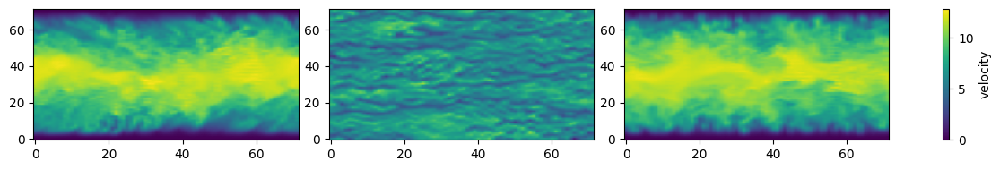
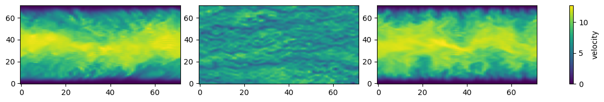

# Turbulent Channel

HydroGym contains a 3D channel flow written in the differentiable programming language [JAX](https://docs.jax.dev/en/latest/notebooks/thinking_in_jax.html). The channel flow is of size $[2\pi, \pi, 2]$, where $z$ is the wall-normal direction. The channel flow is run at $Re_\tau = 180$, and is pre-configured to be controlled with 24 wall-normal jets evenly spaced throughout the wall. The observation value consists of evenly spaced x-velocity values sampled from $y^+ \approx 9$.

## Initializing the Environment

To begin setting up the environment, we firt have to import JAX, the necessary modules from HydroGym. Then we will be able to construct the environment, and work with it.

```python
import jax
import jax.numpy as jnp
import matplotlib.pyplot as plt

# Import channel flow and environment configuration
from hydrogym.jax.envs.channel import ChannelFlowSpectralEnv

env_config = {}
env = ChannelFlowSpectralEnv(env_config)
params = env.default_params
```

to have a clean working environment, we will also need to reset the environment to its initial conditions. These are provided in the [HuggingFace initial fields folder](https://huggingface.co/datasets/dynamicslab/HydroGym-environments).

```python
key = jax.random.PRNGKey(0)
obs, state = env.reset_env(key, params)
print("Initial state shape U:", state.U.shape)
print("Initial state shape V:", state.U.shape)
print("Initial state shape W:", state.U.shape)
print("Initial mean observation value: ", jnp.mean(obs))
```

at which point we can begin to run the environment.

## A First Environment Step

To now interact with the environment, we need to define an action we wish to take. For this we can rely on the default parameters provided by the environment to give us the right dimensions.

```python
action = jnp.zeros((params.action_dim,))
```

Now we can step the environment forward by providing the action to the environment.

```python
obs, state, reward, done, info = env.step_env(key, state, action, params)

print("Mean observation value: ", jnp.mean(obs))
print("Reward:", reward)
```

to validate the right performance of the environment, we should see approximately the following output:

| Type of Variable | Value |
| -------- | -------- |
| Mean Observation Value | 3.3810941472675573 |
| Reward | -0.3378005217734956 |

## Visualizing U without Control

After running the environment step, the state class contains (U,V,W) fields which can be accessed and visualized:

```python
U = state.U
y_idx = 36
z_idx = 8
x_idx = 36
U_slice_xz = U[:, y_idx, :]
U_slice_xy = U[:, :, z_idx]
U_slice_yz = U[x_idx, :, :]

fig, axes = plt.subplots(1, 3, figsize=(10, 2))
slices = [U_slice_xz, U_slice_xy, U_slice_yz]

vmin = min(s.min() for s in slices)
vmax = max(s.max() for s in slices)

for (
    ax,
    slice_,
) in zip(axes, slices):
    im = ax.imshow(
        slice_.T,
        origin="lower",
        aspect="auto",
        vmin=vmin,
        vmax=vmax,
    )
fig.subplots_adjust(right=0.9)

plt.tight_layout(rect=[0, 0, 1.25, 1])
fig.colorbar(im, ax=axes, label="velocity")
plt.show()
```



At which point we can also explore the performance of the full suction jets. Here we will perform $6$ steps in the environment, and then inspect the mean observation values and rewards after each step.

```python
key = jax.random.PRNGKey(0)
obs, state = env.reset_env(key, params)

# action = jax.random.normal(key, (params.action_dim,))
action = 0.01 * jnp.ones((params.action_dim,))
num_steps = 6

for i in range(num_steps):
    obs, state, reward, done, info = env.step_env(key, state, action, params)
    print("Mean observation value after environment step: ", jnp.mean(obs))
    print("Reward:", reward)
```

The performance you should see should look somewhat like the following:

| Steps | Mean Observation Value | Reward |
| -------- | -------- | -------- |
| 1 | 3.3811771453005943 | -0.3379856556277938 |
| 2 | 3.374816954342459 | -0.3296336066794982 |
| 3 | 3.3952557633014124 | -0.32246759246707535 |
| 4 | 3.4049538883848918 | -0.317317974468479 |
| 5 | 3.369506324681792 | -0.31543620069660644 |
| 6 | 3.3887298110075403 | -0.31826735862330213 |

## Visualizing U after a few Steps in the Environment with Control

To visualize the flow after a few steps in the environment with control, we can use the same code as above, i.e.

```python
U = state.U
y_idx = 36
z_idx = 9
x_idx = 36
U_slice_xz = U[:, y_idx, :]
U_slice_xy = U[:, :, z_idx]
U_slice_yz = U[x_idx, :, :]

fig, axes = plt.subplots(1, 3, figsize=(10, 2))
slices = [U_slice_xz, U_slice_xy, U_slice_yz]

vmin = min(s.min() for s in slices)
vmax = max(s.max() for s in slices)

for (
    ax,
    slice_,
) in zip(axes, slices):
    im = ax.imshow(
        slice_.T,
        origin="lower",
        aspect="auto",
        vmin=vmin,
        vmax=vmax,
    )
fig.subplots_adjust(right=0.9)

plt.tight_layout(rect=[0, 0, 1.25, 1])
fig.colorbar(im, ax=axes, label="velocity")
plt.show()
```


