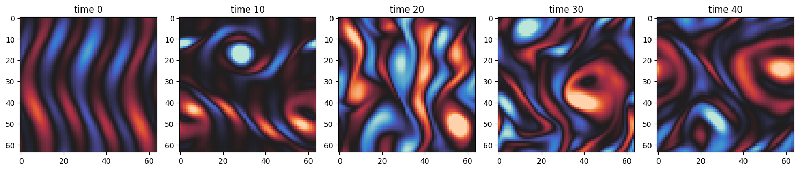
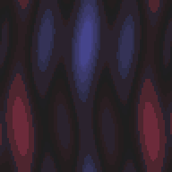
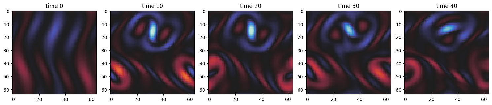

# Kolmogorov

A recent development of Hydrogym is the inclusion of differentiable solvers like [JAX](https://docs.jax.dev/en/latest/notebooks/thinking_in_jax.html). The idea is to leverage the differentiable environment to compute sensitivity studies that can lead to a better controller with less compute time. This tutorial covers how to set up the Kolmogorov JAX environment, and how to run basic control. Currently, the Kolmogorov flow is the main differentiable flow environment implemented in Hydrogym.

## Setting up the JAX Environment

To set up our environment, we begin by first importing JAX, plotting libraries, and the required components from HydroGym. The most important component in HydroGym being the [Pseudospectal Navier Stokes Solver in 2D](https://github.com/dynamicslab/hydroGym/blob/main/hydroGym/jax/envs/kolmogorov.py).

```python
import os
import time
import jax.numpy as jnp
import matplotlib.pyplot as plt
import seaborn as sns
from hydrogym.jax.solvers.base import RungeKuttaCrankNicolson
from hydrogym.jax.utils import io as io
from hydrogym.jax.envs.kolmogorov import FlowConfig, PseudoSpectralNavierStokes2D
```

In addition we will need to define a postprocessing function to then be able to visualize the results:

```python
print_fmt = "vel1: {0:0.3f}\t\t vel2: {1:0.3f}\t\t vel3: {2:0.3e}\t\t vel4: {3:0.3e}"


def log_postprocess(flow):
    """
    The default observation is the velocity at 64 equally spaced points along the domain.
    This postprocess function is computing the mean of the observations.
    """
    obs = flow.get_observations()
    mean_obs_time = jnp.mean(obs, axis=1)
    return mean_obs_time


output_dir = "kolmogorov_data"
np_file_name = "kolmogorov_trajectory"
gif_file_name = "kolmogorov"
os.makedirs(output_dir, exist_ok=True)
```

## The Reinforcement Learning Environment

To set up the reinforcement learning environment, we will be utilizing HydroGym's [FlowConfig](https://github.com/dynamicslab/hydroGym/blob/main/hydroGym/jax/envs/kolmogorov.py). If you would like to change the grid resolution, you will need to define it as an argument of the FlowConfig, like

```python
FlowConfig(domain_x = 256, domain_y = 256)...
```

The default here is $64 \times 64$. If you would like to change the Reynolds number, specifically to view extreme events, set ``flow.Re``to be between 40 - 80. The default Reynolds number is 200, a fully turbulent state.

```python
flow = FlowConfig()
flow.Re = 100
dt = 0.001
equation = PseudoSpectralNavierStokes2D(flow)
solver = RungeKuttaCrankNicolson(flow, dt, 1, equation)
end_time = 50  # This is in seconds!

callbacks = [
    io.LogCallback(
        postprocess=log_postprocess,
        interval=1,
        filename=f"{output_dir}/kolmogorov.dat",
        print_fmt=print_fmt,
    ),
]
```

Make sure to run the above code on the GPU. If you have access to a GPU, this will run much faster and you can run it at a higher grid resolution.

```python
def check_jax_device():
    from jax.lib import xla_bridge

    device = xla_bridge.get_backend().platform
    print(f"JAX is using: {device}")


check_jax_device()
start = time.time()
final, trajectory = solver.solve(dt, flow, (0, end_time), callbacks, None, save_n=1)
end = time.time()
jnp.save(output_dir + "/" + np_file_name, trajectory)
print("Total time:", end - start)
```

## Visualizing the Results

At which point we are able to visualize the results and see how the Kolmogorov flow evolves in time.

```python
cols = 5
fig, axs = plt.subplots(1, cols, figsize=(15, 5))

simulation = jnp.load(output_dir + "/" + np_file_name + ".npy")

data = jnp.fft.irfftn(simulation, axes=(1, 2))

for i in range(cols):
    time = int(len(data) * (i / cols))
    axs[i].imshow(data[time], cmap="icefire", vmin=-8, vmax=8)
    axs[i].set_title("time {}".format(time))

plt.tight_layout()
plt.show()
```



### GIF Generation

We can furthermore summarize the evolution of the flow in time with a GIF utilizing the [imageio](https://imageio.readthedocs.io/en/stable/) library.

```python
import numpy as np
import imageio.v2 as imageio

frames = []
for i in range(data.shape[0]):
    fig, ax = plt.subplots(figsize=(4, 4))
    ax.imshow(data[i], cmap="icefire")
    ax.axis("off")
    fig.canvas.draw()
    image = np.frombuffer(fig.canvas.tostring_rgb(), dtype="uint8")
    image = image.reshape(fig.canvas.get_width_height()[::-1] + (3,))
    frames.append(image)

    plt.close(fig)

imageio.mimsave(output_dir + "/" + gif_file_name + ".gif", frames, fps=10)
```



## Applying Control

To add a controller to the system, simply specify the desired controller under `flow.control_function`. For instance, if one would like a control of sinusoidal forcing of wavenumber 4 and amplitude of -0.5, we can do the following:

```python
x, y = flow.load_mesh(name="")

def control_func(a, k, y):
    return (a * jnp.sin(k * y), jnp.zeros_like(y))

flow.control_function = control_func(-0.6, 4, y)
final, trajectory = solver.solve(dt, flow, (0, end_time), callbacks, None, save_n=1)
jnp.save(output_dir + "/" + "kolmogorov_controlled", trajectory)
```

the controlled flow can then be visualized as follows:

```python
cols = 5
fig, axs = plt.subplots(1, cols, figsize=(15, 5))

simulation = jnp.load(output_dir + "/" + "kolmogorov_controlled" + ".npy")

data = jnp.fft.irfftn(simulation, axes=(1, 2))

for i in range(cols):
    time = int(len(data) * (i / cols))
    axs[i].imshow(data[time], cmap="icefire", vmin=-8, vmax=8)
    axs[i].set_title("time {}".format(time))

plt.tight_layout()
plt.show()
```



For comparison, here is the uncontrolled Kolmogorov flow from earlier in the example:


