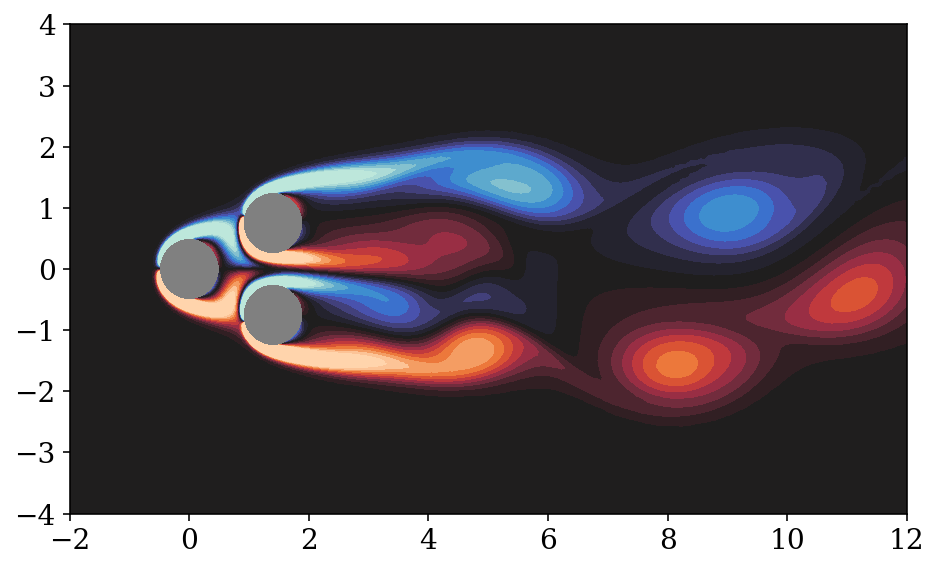
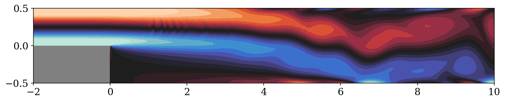

Quickstart
==========

Before getting started, follow the :ref:`installation` guide to get everything set up.

Running an environment
----------------------

The `overview notebook <https://github.com/dynamicslab/hydrogym/blob/main/notebooks/overview.ipynb>`_ 
has a quick tour of some of the basic ideas of how to get Hydrogym to work in code - this is an
abbreviated version.

First, the `hydrogym` package is designed to be fairly general in that the basic interface
for PDE control is defined in `hydrogym.core` and isn't linked to any particular solver.  So even
though the default environments are all implemented using the Firedrake finite element framework,
you can add your own solver ("backend") and reuse the distributed training infrastructure for
reinforcement learning.

But for now we'll just use the built-in flow environments, so we need to import `hydrogym.firedrake`:

.. code-block:: python

    import hydrogym.firedrake as hgym

The next step is to set up the "environment" (in RL terminology), which defines the geometry, boundary
conditions, actuation, transient solver, etc. of the flow configuration.  We do this by passing the general Firedrake
`FlowEnv` configuration options:

.. code-block:: python

    env_config = {
        "flow": hgym.Cylinder,
        "flow_config": {
            "restart": "examples/demo/checkpoint.h5",
        },
    }
    env = hgym.FlowEnv(env_config)

In short, the `FlowEnv` combines a `FlowConfig` (in this case `Cylinder`, specifying flow past
a circular cylinder) with a `TransientSolver` (at the moment only `IPCS` is implemented, so we can leave
the default here). 
Other flow configurations implemented by default are described in the next section.

The `"restart"` option points to an HDF5 file saved by Firedrake that will be used as the initial condition
for the flow.  If this is omitted, the flow will be initialized from a zero velocity/pressure state.  You can
typically expect better behavior in the first few timesteps when starting from a restart file
(whether steady state, mean flow, transient snapshot, etc) rather than a zero initial condition.

The `FlowEnv` provides an OpenAI Gym-compliant API for flow control, so integrating the flow is as simple as:

.. code-block:: python
    
    actuation = ctrl(obs)
    obs, reward, done, info = env.step(actuation)

Default flow configurations:
----------------------------

Hydrogym includes several simplistic flow configurations that are benchmark problems in flow control and
reduced-order modeling.  This section describes a little about the benchmark configuration, control, and
dynamics, although these can be changed (for instance by modifying the Reynolds number).  Each section
also has a couple of useful references for the flow, although these should by no means be considered 
comprehensive literature reviews.

Cylinder wake
*************

.. image:: _static/imgs/cylinder.png
   :width: 600

The flow past a circular cylinder is a canonical problem in stability analysis, low-dimensional modeling,
and flow control.  At Reynolds number 100 the flow is linearly unstable and eventually reaches a post-transient
state of periodic vortex shedding.

From a flow control perspective, this is a benchmark problem in stabilization and drag reduction, since the
unstable steady state is associated with lower drag than the instantaneous or mean post-transient flow.  In 
some works the controller is taken to be a body force acting downstream of the cylinder.  However, in order to
make the situation slightly more realistic, we have instead implemented actuation by rotation of the cylinder.
By default, the available measurements are the lift and drag coefficients on the cylinder.

**References**

* `Noack, et al (2003) <http://berndnoack.com/publications/2003_JFM_Noack.pdf>`_
* `Sipp & Lebedev (2007) <https://www.cambridge.org/core/journals/journal-of-fluid-mechanics/article/abs/global-stability-of-base-and-mean-flows-a-general-approach-and-its-applications-to-cylinder-and-open-cavity-flows/EC31631718EB33AA5C671A8F7EAA043C>`_
* `Sipp, et al (2010) <http://www.ladhyx.polytechnique.fr/people/meliga/pdf/AMR.pdf>`_
* `Loiseau, Brunton, Noack (2021) <https://hal.science/hal-02398729>`_

Fluidic pinball
***************

Building on the complexity of the flow past a cylinder, the "pinball" flow adds two additional
cylinders in an equilateral triangle, creating a multi-input multi-output problem.  Again the objective
is to minimize the net drag given measurements of lift and drag on each cylinder (total 6 outputs).  Each
cylinder can be rotated independently (total 3 inputs).

The dynamics of the pinball quickly become more complex than the cylinder; by Reynolds number 30 the flow
is chaotic, making this a much more challenging control problem.

**References**

* `Deng, et al (2020) <https://arxiv.org/pdf/1812.08529>`_
* `Bieker, et al (2020) <https://link.springer.com/article/10.1007/s00162-020-00520-4>`_
* `Peitz, Otto, & Rowley (2020) <https://arxiv.org/abs/2003.07094>`_
* `Maceda, et al (2021) <https://www.cambridge.org/core/services/aop-cambridge-core/content/view/D112E47F261BD4C611D0CB94A0A3FF38/S0022112021003013a.pdf/stabilization-of-the-fluidic-pinball-with-gradient-enriched-machine-learning-control.pdf>`_

Open cavity flow
****************

.. image:: _static/imgs/cavity.png
   :width: 600

The open cavity flow is another classic problem in modeling and control.  Above a critical Reynolds number about 4150 the flow becomes
unstable with self-sustaining oscillations.  By Reynolds number 7500 a second low-frequency inner cavity mode pair is also excited in additional
to the shear layer oscillations, leading to quasiperiodic dynamics.  In the benchmark configuration the flow is actuated at the leading edge
(upstream of the cavity) and measured at the trailing edge (downstream of the cavity), so there is an additional time-delay consideration not
present in the cylinder and pinball flows.

**References**

* `Sipp & Lebedev (2007) <https://www.cambridge.org/core/journals/journal-of-fluid-mechanics/article/abs/global-stability-of-base-and-mean-flows-a-general-approach-and-its-applications-to-cylinder-and-open-cavity-flows/EC31631718EB33AA5C671A8F7EAA043C>`_
* `Sipp, et al (2010) <http://www.ladhyx.polytechnique.fr/people/meliga/pdf/AMR.pdf>`_
* `Callaham, Brunton, Loiseau (2021) <https://www.cambridge.org/core/services/aop-cambridge-core/content/view/CC2980F9AA4AC20A7453C3056ED950C4/S0022112021009940a.pdf/on-the-role-of-nonlinear-correlations-in-reduced-order-modelling.pdf>`_

Backwards-facing step
*********************

The backwards-facing step is a benchmark problem used both in modeling and control and as a test of numerical methods.  The flow is constricted
upstream and expands over a step to a straight channel downstream.  While the flow is linearly stable at moderate Reynolds numbers (Re=600 by
default here), it is an "amplifier" flow, meaning that small disturbances are amplified over a finite time horizon before being advected out
of the domain.  Hence, this flow configuration is forced by small-amplitude random noise upstream of the step, in the approximate region where 
analysis shows the flow is most sensitive to disturbances.

**References**

* `Boujo & Gallaire (2015) <https://www.cambridge.org/core/journals/journal-of-fluid-mechanics/article/abs/sensitivity-and-openloop-control-of-stochastic-response-in-a-noise-amplifier-flow-the-backwardfacing-step/3CEEBB6AD9784D555FDA086AF81BD416>`_
* `Beneddine, et al (2016) <https://hal.inria.fr/hal-01445633/>`_
* `Ducimetière, et al (2022) <https://www.cambridge.org/core/journals/journal-of-fluid-mechanics/article/weak-nonlinearity-for-strong-nonnormality/ADCBEAB2B445907FF022DD5E4F79A001>`_
